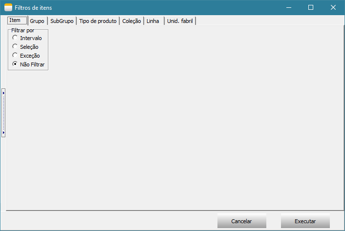
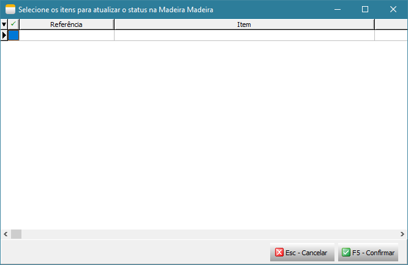
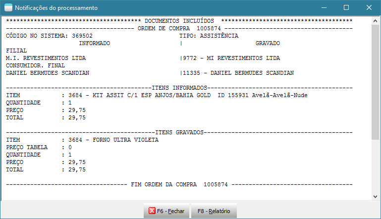
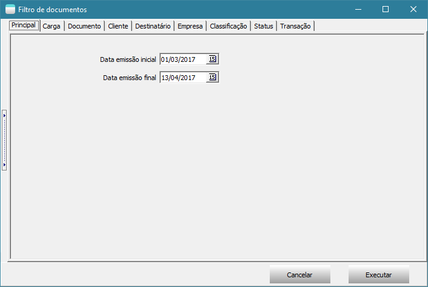
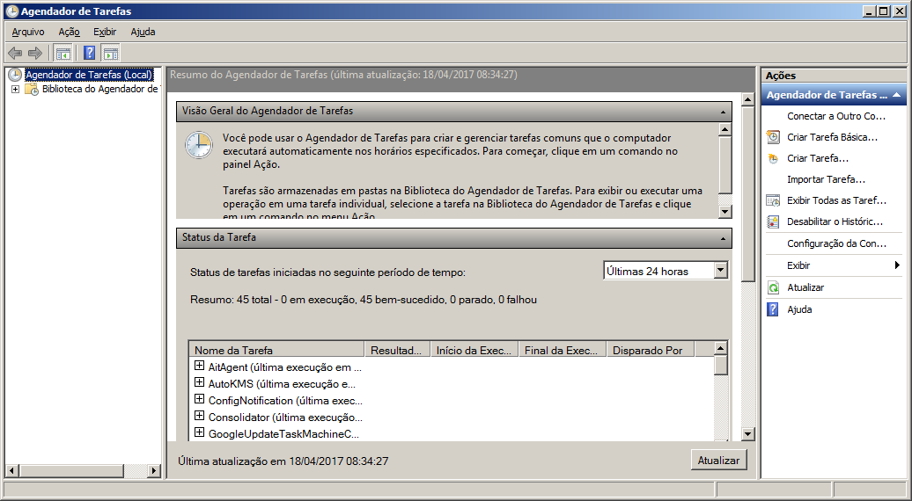

## A Integração

(Processo de integração com o E-commerce)

Veja a [Especificação Técnica](Especificação_Técnica_Projeto_VendaAOrdem.pdf) para mais detalhes.

#### O que é Venda à Ordem?
Venda à ordem é uma operação triangular, configura-se como aquela em que determinada mercadoria é adquirida sob a condição
de a sua entrega ser efetivada pelo próprio fornecedor em estabelecimento de terceiro, por conta e ordem do adquirente
originário.
A venda à ordem é uma modalidade de operação triangular, pois envolve 3 estabelecimentos em uma mesma operação. Assim,
nesse tipo de venda, serão utilizadas as seguintes denominações para se abordar o tratamento fiscal adotado:

  a) fornecedor - estabelecimento que vende a mercadoria;

  b) adquirente original - estabelecimento que adquire a mercadoria e já a revende, sem que essa transite por seu estabelecimento, ou seja,
     solicita que a mercadoria adquirida seja entregue diretamente a seu cliente;

  c) destinatário - estabelecimento que adquiriu a mercadoria do adquirente original.

#### Informações Importantes

* Obrigatório controlar estoque dos itens (Pedido e Assistência);
*  Atribuir no parâmetro de funcionamento do sistema os status “Faturamento Solicitado à órgão”, NFe “Compartilhada ao Órgão” e “Faturamento Pendente”;
*  Criar as transações para nota fiscal de remessa simbólica. Nesta transação deve desmarcar “Movimenta Estoque”, “marcar Gera Receber” e “Venda à Ordem”;
*  Criar as transações para nota fiscal por conta e ordem (acobertar o transporte). Nesta transação deve marcar “Movimenta Estoque” e desmarcar “Gera Receber” e “Venda à Ordem”;
+ Criar as tags características que serão vinculadas aos itens, são:
  1. Compartilhar Item(lógico): Obrigatório;
  2. Sequência de montagem(numérico): Opcional;
  3. Quantidade máximo a montar(numérico): Opcional;
  4. Quantidade reservada à empresa(numérico): Opcional. Obs.: Não definindo as tags opcionais, a sequência de montagem será aleatória, sempre irá montar o máximo
     e não terá estoque reservado a empresa.
* Vincular ao “Adquirente Original” a(s) tabela de preço(s) para pedido de venda e assistência, devendo especificar corretamente para o que estará disponível
  (Pedido de Venda e/ou Assistência);
* Configurar no “Padrões de Compra” do Adquirente Original a “Modalidade de Frete” como Terceiros e “Tipo Frete” como Acessórios;
* Faturamento via processamento específico: Na hipótese de erro de transmissão, não deve reprocessar documentos trocando a forma de emissão, deve-se aguardar reestabelecer o serviço (SEF) ou cancelar/inutilizar;
* Automatizando todo o processo via agendamento, é necessário instalar o certificado digital no servidor. Este certificado digital deve ser do tipo A1.

#### Cadastros e configurações

##### Parâmetro de funcionamento
Acesse o parâmetro de funcionamento na guia “Status” e defina os status abaixo:
  - Faturamento Solicitado à Órgão;
  - Faturamento Pendente;
  - NFe Compartilhada ao Órgão.
Esses status são utilizados durante o processamento das operações.

+ Transações para venda
  1. Crie uma transação para “Remessa por Conta e Ordem de Terceiros”:
     1. CFOPs 5923 / 6923:
     2. Esta transação não deve destacar impostos, de acordo com o Art. 266, §4º, b
     3. Marcar Movimenta Estoque.
     4. Desmarcar Gera Receber
     5. Desnarcar Venda à Ordem.

  2. Crie uma segunda transação para “Remessa Simbólica – Venda à Ordem”:
     1. CFOPs 5118 / 6118: Utilizados quando se tratar de produção do estabelecimento;
        CFOPs 5119 / 6119: Quando se tratar de mercadoria adquirida ou recebida de terceiros.
     2. Os impostos são tributados normalmente, quando devido.
     3. Desmarcar Movimenta Estoque
     4. Marcar Gera Receber
     5. Marcar Venda à Ordem

+ Transações para assistência
  1. Crie uma transação para “Remessa por Conta e Ordem de Terceiros”:
     1. CFOPs 5949 / 6949: Remessa de mercadoria por conta e ordem de terceiros, em bonificação à ordem.
     2. Marcar Movimenta Estoque
     3. Desmarcar Gera Receber.
     4. Desnarcar Venda à Ordem.

  2. Crie uma transação para “Remessa Simbólica”:
     1. CFOPs 5118 / 6118: Venda de produção do estabelecimento entregue ao destinatário por conta e ordem do adquirente originário,
      em venda à ordem – assistência técnica.
     2. Desmarcar “Movimenta Estoque”,
     3. Marcar Gera Receber.
     4. Marcar Venda à Ordem.

+ Transações para assistência bonificada
  1. Crie uma transação para “Remessa por Conta e Ordem de Terceiros”:
     1. CFOPs 5949 / 6949: Remessa de mercadoria por conta e ordem de terceiros, em bonificação à ordem.
     2. Marcar “Movimenta Estoque”
     3. Desmarcar Gera Receber
     4. Desmarcar Venda à Ordem

  2. Crie uma transação para “Remessa Simbólica”:
     1. CFOPs 5949 / 6949: Remessa de mercadoria por conta e ordem de terceiros, em bonificação à ordem.
     2. Desmarcar “Movimenta Estoque”.
     3. Marcar Gera Receber.
     4. Marcar Venda à Ordem.

* Cadastro de Mensagem para Nota Fiscal venda remessa simbólica
Crie uma mensagem para nota fiscal com o seguinte texto:

   > “Emitida nos termos do artigo xxx, §xx do RICMS/xxxx(ano) – XX(estado da empresa).

   Onde está “x” deve ser preenchido de acordo com o estado da empresa. Está mensagem deve ser vinculada ao parâmetro de funcionamento -> mensagens.
   Deve relacionar ao “Documento Referenciado”.

* Cadastro de Mensagem para Nota Fiscal assistência bonificada
Crie uma mensagem para nota fiscal com o seguinte texto:

   > “Produto bonificado tributado integralmente (ou isento) nos termos do art. xxx, §xx, da lei(ou RICMS) xxxx – XX(estado do fornecedor)”.

   Onde está “x” deve ser preenchido de acordo com o estado da empresa. Está mensagem deve ser vinculada ao parâmetro de funcionamento -> mensagens extras.

* Cadastro de Tags Características
Crie as tags características abaixo:
  1. Compartilhar Item(lógico): Uso obrigatório. Deve vincular aos itens que serão compartilhados com a MadeiraMadeira.
  2. Sequência de montagem(numérico): Uso opcional. Determina a sequência de montagem de produtos (relatório de Montagem x Sobras - PCP) em casos onde um mesmo volume é usado em mais de um produto.
  3. Quantidade máximo a montar(numérico): Uso opcional. Determina a quantidade máxima a montar do produto (relatório de Montagem x Sobras - PCP). Trabalha em conjunto com a tag anterior.
  4. Quantidade reservada à empresa(numérico): Uso opcional. Determina a quantidade de itens que será reservada à empresa.

    Acesse o cadastro de itens e faça o vínculo com as tags características.

#### Cadastro do usuário

Acesse o cadastro do usuário, guia “Processamentos” e adicione todos os processamentos referente a integração com a MadeiraMadeira.

Obs.: Somente realize está etapa se optar pela integração manual.

#### Cadastro da tabela de preço
Crie duas tabelas de preço, uma para pedido de venda e a outra para assistência. Para cadastrar a tabela de preço deve seguir alguns critérios:

* Não permite “Lançar Descontos”;
* A condição de pagamento é a combinada com a MadeiraMadeira.

#### Cadastro do cliente Madeira Madeira
Para cadastrar o cliente MadeiraMadeira deve seguir alguns critérios para preenchimento das informações do padrão de compra:

* Tipo de frete: 2 – Terceiros;
* Opção do frete: Acessório;
* Condição Pagto: A prazo;
* Consultor de venda: Deve definir um consultor de venda padrão;
* Supervisor de venda: Caso não seja definido no cadastro do cliente, irá buscar o supervisor do cadastro do consultor de venda;
* Tabela de preço e condição de pagto: Deve definir a tabela de preço para pedido e assistência.

### Processamentos da integração
Todo processo de integração pode ser automatizado e por esse motivo, e para isso pode ser usado o Agendador de Tarefas do Windows. 
Veremos como criar esse agendamento no decorrer deste manual. Está integração é realizada através dos processamentos específicos 
acessados através da tela principal e estão disponíveis nos módulos Faturamento, Integração de Sistemas e BI – Inteligência de Negócios. 

#### Inicializando as parametrizações(TEK-> MADEIRA MADEIRA: INICIALIZAÇÃO)
O 1º processamento específico que devemos executar é o TEK-> MADEIRA MADEIRA: INICIALIZAÇÃO. Este processamento irá criar uma unidade de  
codificação com todos os parâmetros necessários para integração.

__Obs.: Todos os processamentos possuem observações importantes que devem ter uma atenção especial.__

Ao executar este processamento, será exibido a tela abaixo onde deve ser parametrizado usando todas as configurações realizadas acima. Após executa-la, 
será criado uma unidade de codificação(unit) chamada MADEIRA_MADEIRA_CONFIGURACAO, está unit não deve ser alterada, pois todo processo de integração 
depende dela. Nesta mesma unit possui alguns exemplos de como agendar os processamentos no Agendador de Tarefas do Windows. 

#### Atualizando o saldo do item(TEK-> MADEIRA MADEIRA: ATUALIZAR ESTOQUE)

O processamento TEK-> MADEIRA MADEIRA: ATUALIZAR ESTOQUE irá atualizar o saldo do item no site. Ao executa-lo será exibido uma tela com filtros e em seguida 
será executado o processo. A atualização do saldo do item irá depender da forma de trabalho da empresa, caso a empresa controle estoque de volume, será utilizado 
o relatório de Montagem x Sobras, caso não controle estoque de volume e sim do produto, será utilizando o saldo gravado no detalhamento do item. 

#### Atualizando o status do item(TEK-> MADEIRA MADEIRA: ATUALIZAR STATUS)
O processamento TEK-> MADEIRA MADEIRA: ATUALIZAR STATUS irá atualizar o status dos itens no site, este processo considera apenas os itens que tiverem alterações no dia. 
Ao executa-lo será exibido uma tela com filtros e em seguida será executado o processo.

#### Importação de pedido de venda/assistência técnica(TEK-> MADEIRA MADEIRA: IMPORTAR DOCUMENTOS)
O processamento TEK-> MADEIRA MADEIRA: IMPORTAR DOCUMENTOS irá atualizar o status dos itens no site, este processo considera apenas os itens que tiverem alterações no dia.
Ao executa-lo será exibido uma tela para selecionar todos os documentos que deseja importar, após importar os documentos, não será possível importar o mesmo documento
novamente.

Após importação é exibido um detalhamento do que foi importado e também é gravado um arquivo texto no documento com todas as informações importadas da MadeiraMadeira.

Após importação segue o fluxo de conferência do documento, formação de carga e reserva.

#### Solicitar autorização de Faturamento à MadeiraMadeira(TEK-> MADEIRA MADEIRA: SOLICITAR FATURAMENTO)
O processamento TEK-> MADEIRA MADEIRA: SOLICITAR FATURAMENTO irá solicitar à MadeiraMadeira a autorização para emissão das notas fiscais(remessa e simbólica). 
Somente serão autorizados documentos que estiverem em carga e que estejam totalmente reservados. São essas operações que irão garantir que o item possui  
estoque e está pronto para dar andamento na entrega da mercadoria. Ao executa-lo será exibido uma tela com filtros de documentos e em seguida será executado  
o processo.

#### Verificar se o faturamento foi liberado pela MadeiraMadeira(TEK-> MADEIRA MADEIRA: VERIFICAR SE FATURAMENTO LIBERADO)

O processamento TEK-> MADEIRA MADEIRA: VERIFICAR SE FATURAMENTO LIBERADO irá monitorar o webservice da MadeiraMadeira aguardando a emissão da nota fiscal 
de venda ao consumidor final pela MadeiraMadeira, caso a nota fiscal esteja liberada será feito a importação da nota fiscal emitida pela MadeiraMadeira  
para o consumidor final e irá atualizar os dados do transportador inserindo-o na carga, atualizar o valor unitário e valor total dos itens para destinatário 
final no documento(pedido/assistência), importar o transportador redespacho e inclui-lo nas observações para nota fiscal de venda à ordem no  
documento(pedido/assistência), atualizar os dados do destinatário final e inserir no documento da carga o número, modelo, série, data de emissão e chave 
da nota fiscal. Ao executa-lo será exibido uma tela com filtros de documentos e em seguida será executado o processo. 

Após importação de todos os dados da nota fiscal, é exibido uma tela com detalhamento do que foi importado e também é gravado um arquivo texto no documento
com todas as informações importadas da MadeiraMadeira.

#### Emitindo nota fiscal(TEK-> MADEIRA MADEIRA: EMITIR NFE)
O processamento TEK-> MADEIRA MADEIRA: EMITIR NFE irá emitir as notas fiscais de remessa e simbólica somente dos documentos que o faturamento foi liberado 
através do processamento TEK-> MADEIRA MADEIRA: VERIFICAR SE FATURAMENTO LIBERADO. Ao executar será exibido uma tela com filtros de documentos e em seguida 
será executado o processo.

#### Enviando notas fiscais para MadeiraMadeira(TEK-> MADEIRA MADEIRA: COMPARTILHAR NFE)
O processamento TEK-> MADEIRA MADEIRA: COMPARTILHAR NFE irá enviar o XML das notas fiscais de remessa e simbólica para MadeiraMadeira. Somente será enviado  
otas fiscais faturadas. Ao executar será exibido uma tela com filtros de documentos e em seguida será executado o processo.

### Agendamento dos processos no Agendador de Tarefas do Windows

  > __Importante: Levante um TekServer somente para execução destes processamentos. Este TekServer deve ser 32 bits.__

Para realizar o agendamento dos processos no Agendador de Tarefas do Windows, acesse Painel de Controle -> Ferramentas Administrativas -> Agendador de Tarefas.

Selecione Biblioteca do Agendador de Tarefas e clique em Nova Pasta para criar uma pasta chamada Tek-System.

Em seguida selecione a pasta Tek-System e clique em Criar Tarefa...

Na tela “Criar Tarefa” deve seguir um padrão para o nome conforme exemplo abaixo.

  > Exemplo: Madeira Madeira: Atualizar estoque.

Defina o intervalo de execução do agendamento na guia Disparadores junto com o responsável pelo servidor da empresa.

Na guia Ações clique em Novo para informar o script a ser executado neste agendamento. Ao clicar em Novo será aberto a tela abaixo.

No campo Programa/Script adicione o script para agendamento conforme descrito abaixo.
A execução do processamento é realizada pelo módulo ExecMetodoInterpERP.exe, para executar as funções abaixo é necessário preencher alguns parâmetros, são:

* -U: Nome do usuário que irá executar o processamento. O ideal é criar um usuário específico para isso;
* -S: Senha do usuário;
* -P: Porta de conexão com o TekServer;
* -E: Código da empresa;
* -M: Nome do método a ser executado.

Confira se o módulo ExecMetodoInterpERP.exe está no diretório “C:\tek-system\execmc\”. Este módulo fica localizado no diretório dos executáveis do sistema.

> __Importante__: Antes de criar o agendamento para cada script abaixo, faça um teste de execução através do prompt de comando. Para testar a funcionamento do script,
 copie e cole-o no prompt de comando e tecle Enter para ver o resultado.

Abaixo contém todos os script para cada processamento.

* Automatizar a atualização de saldos:
  > C:\tek-system\execmc\ExecMetodoInterpERP.exe -U:NOME_USUARIO -S:SENHA -P:5700 -E:1 -M:TEK_MADEIRA_MADEIRA_ITENS.ATUALIZAR_ESTOQUE('')
* Automatizar a atualização de status de itens:
  > C:\tek-system\execmc\ExecMetodoInterpERP.exe -U:NOME_USUARIO -S:SENHA -P:5700 -E:1 -M:TEK_MADEIRA_MADEIRA_ITENS.ATUALIZAR_STATUS('')
* Automatizar a importação de pedidos do site:
  > C:\tek-system\execmc\ExecMetodoInterpERP.exe -U:NOME_USUARIO -S:SENHA -P:5700 -E:1 -M:TEK_MADEIRA_MADEIRA_DOCUMENTOS.IMPORTAR
* Automatizar aviso de venda à ordem pronta para faturamento:
  > C:\tek-system\execmc\ExecMetodoInterpERP.exe -U:NOME_USUARIO -S:SENHA -P:5700 -E:1 -M:TEK_MADEIRA_MADEIRA_VENDA_A_ORDEM.SOLICITAR_FATURAMENTO('')
* Automatizar monitoramento de faturamento liberado pela MadeiraMadeira:
  > C:\tek-system\execmc\ExecMetodoInterpERP.exe -U:NOME_USUARIO -S:SENHA -P:5700 -E:1 -M:TEK_MADEIRA_MADEIRA_VENDA_A_ORDEM.VERIFICAR_SE_FATURAMENTO_LIBERADO('')
* Automatizar faturamento de venda à ordem:
  > C:\tek-system\execmc\ExecMetodoInterpERP.exe -U:NOME_USUARIO -S:SENHA -P:5700 -E:1 -M:TEK_MADEIRA_MADEIRA_EMISSAO_NFE.FATURAR
* Compartilhar Notas Fiscais com WebService
  > C:\tek-system\execmc\ExecMetodoInterpERP.exe -U:NOME_USUARIO -S:SENHA -P:5700 -E:1 -M:TEK_MADEIRA_MADEIRA_COMPARTILHAR_NFE.COMPARTILHAR

#### Indicadores

É disponibilizado 3 indicadores padrões para auxiliar na integração com MadeiraMadeira, são:

* MADEIRA MADEIRA: QTDE DOC. SEM PEDIDO DE AUTORIZAÇÃO P/ FAT: Apresenta a quantidade de documentos importados que não estão em carga e/ou não foram 
  totalmente reservados;
* MADEIRA MADEIRA: QTDE DOC. AGUARDANDO AUTORIZAÇÃO P/ FAT: Apresenta a quantidade de documentos que já estão em carga totalmente reservados aguardando 
  autorização da MadeiraMadeira para faturar;
* MADEIRA MADEIRA: QTDE DOC. FATURAMENTO PENDENTE PELA EMPRESA: Apresenta a quantidade de documentos autorizados pela MadeiraMadeira, mas pendente de 
  faturamento pela empresa.

Todos esses indicadores possuem detalhamentos por documento e por item.

# Dúvidas ou Sugestões?

Caso você não esteja logado, faça seu login, acesse a area de [Issues](/../issues) e cadastre sua dúvida ou sugestão.