### Processamentos da integração
Todo processo de integração pode ser automatizado e por esse motivo, e para isso pode ser usado o Agendador de Tarefas do Windows. 
Veremos como criar esse agendamento no decorrer deste manual. Está integração é realizada através dos processamentos específicos 
acessados através da tela principal e estão disponíveis nos módulos Faturamento, Integração de Sistemas e BI – Inteligência de Negócios. 

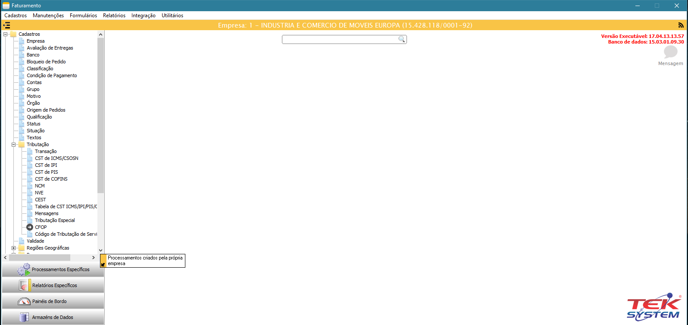

#### Inicializando as parametrizações(TEK-> MADEIRA MADEIRA: INICIALIZAÇÃO)
O 1º processamento específico que devemos executar é o TEK-> MADEIRA MADEIRA: INICIALIZAÇÃO. Este processamento irá criar uma unidade de  
codificação com todos os parâmetros necessários para integração.

__Obs.: Todos os processamentos possuem observações importantes que devem ter uma atenção especial.__

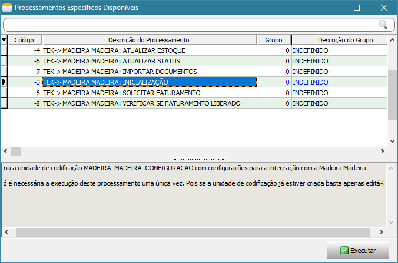

Ao executar este processamento, será exibido a tela abaixo onde deve ser parametrizado usando todas as configurações realizadas acima. Após executa-la, 
será criado uma unidade de codificação(unit) chamada MADEIRA_MADEIRA_CONFIGURACAO, está unit não deve ser alterada, pois todo processo de integração 
depende dela. Nesta mesma unit possui alguns exemplos de como agendar os processamentos no Agendador de Tarefas do Windows. 

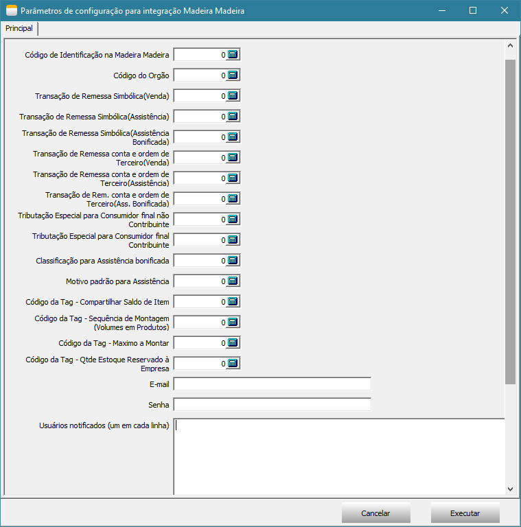

#### Atualizando o saldo do item(TEK-> MADEIRA MADEIRA: ATUALIZAR ESTOQUE)

O processamento TEK-> MADEIRA MADEIRA: ATUALIZAR ESTOQUE irá atualizar o saldo do item no site. Ao executa-lo será exibido uma tela com filtros e em seguida 
será executado o processo. A atualização do saldo do item irá depender da forma de trabalho da empresa, caso a empresa controle estoque de volume, será utilizado 
o relatório de Montagem x Sobras, caso não controle estoque de volume e sim do produto, será utilizando o saldo gravado no detalhamento do item. 

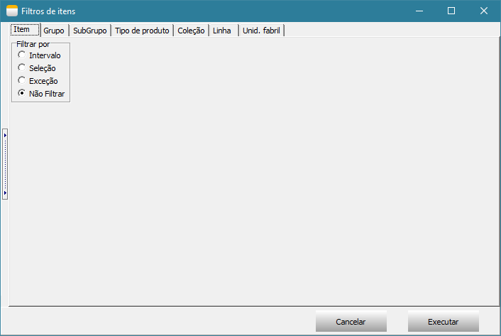

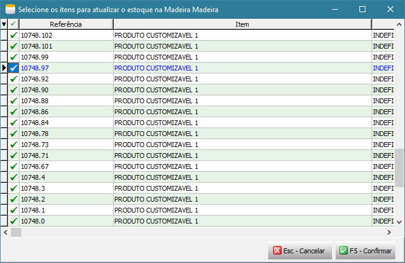

#### Atualizando o status do item(TEK-> MADEIRA MADEIRA: ATUALIZAR STATUS)
O processamento TEK-> MADEIRA MADEIRA: ATUALIZAR STATUS irá atualizar o status dos itens no site, este processo considera apenas os itens que tiverem alterações no dia. 
Ao executa-lo será exibido uma tela com filtros e em seguida será executado o processo.

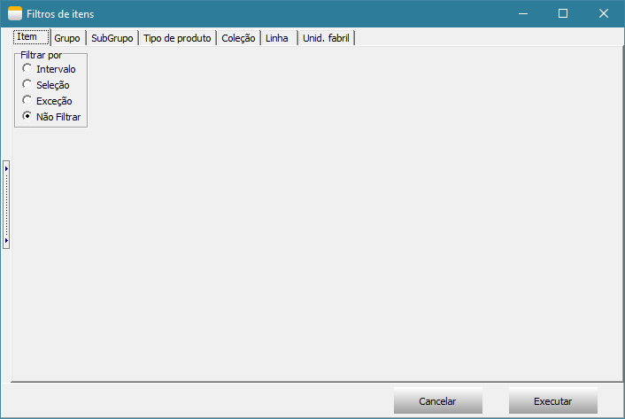

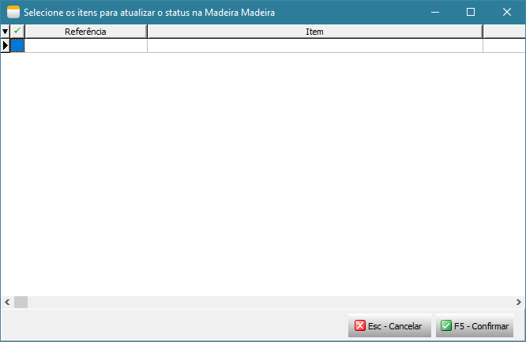

#### Importação de pedido de venda/assistência técnica(TEK-> MADEIRA MADEIRA: IMPORTAR DOCUMENTOS)
O processamento TEK-> MADEIRA MADEIRA: IMPORTAR DOCUMENTOS irá atualizar o status dos itens no site, este processo considera apenas os itens que tiverem alterações no dia.
Ao executa-lo será exibido uma tela para selecionar todos os documentos que deseja importar, após importar os documentos, não será possível importar o mesmo documento
novamente.

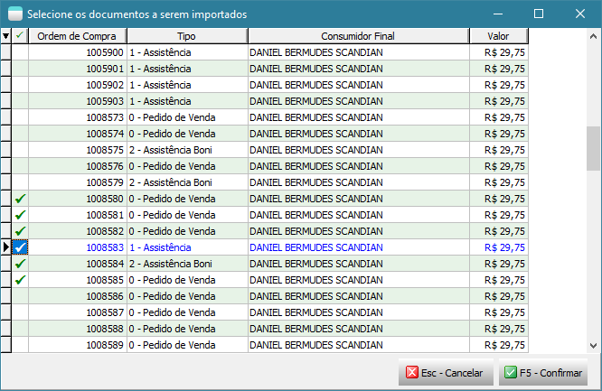

Após importação é exibido um detalhamento do que foi importado e também é gravado um arquivo texto no documento com todas as informações importadas da MadeiraMadeira.

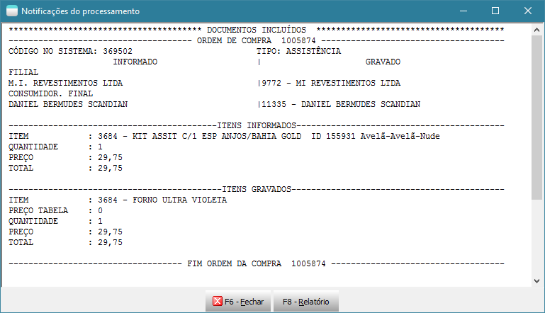

Após importação segue o fluxo de conferência do documento, formação de carga e reserva.

#### Solicitar autorização de Faturamento à MadeiraMadeira(TEK-> MADEIRA MADEIRA: SOLICITAR FATURAMENTO)
O processamento TEK-> MADEIRA MADEIRA: SOLICITAR FATURAMENTO irá solicitar à MadeiraMadeira a autorização para emissão das notas fiscais(remessa e simbólica). 
Somente serão autorizados documentos que estiverem em carga e que estejam totalmente reservados. São essas operações que irão garantir que o item possui  
estoque e está pronto para dar andamento na entrega da mercadoria. Ao executa-lo será exibido uma tela com filtros de documentos e em seguida será executado  
o processo.

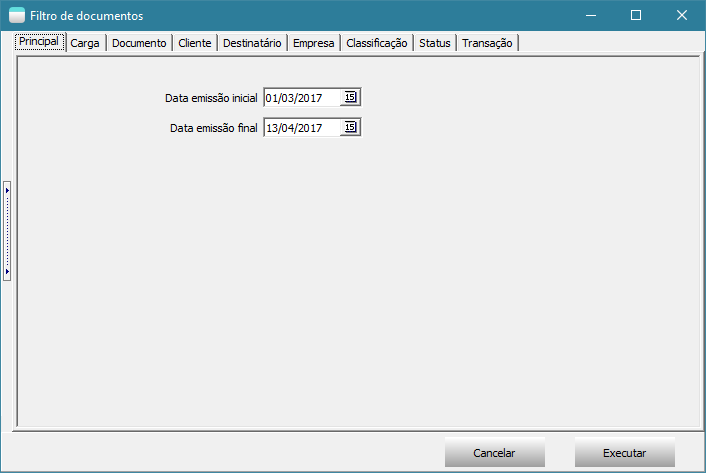

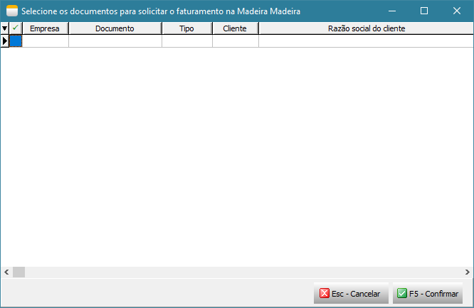

#### Verificar se o faturamento foi liberado pela MadeiraMadeira(TEK-> MADEIRA MADEIRA: VERIFICAR SE FATURAMENTO LIBERADO)

O processamento TEK-> MADEIRA MADEIRA: VERIFICAR SE FATURAMENTO LIBERADO irá monitorar o webservice da MadeiraMadeira aguardando a emissão da nota fiscal 
de venda ao consumidor final pela MadeiraMadeira, caso a nota fiscal esteja liberada será feito a importação da nota fiscal emitida pela MadeiraMadeira  
para o consumidor final e irá atualizar os dados do transportador inserindo-o na carga, atualizar o valor unitário e valor total dos itens para destinatário 
final no documento(pedido/assistência), importar o transportador redespacho e inclui-lo nas observações para nota fiscal de venda à ordem no  
documento(pedido/assistência), atualizar os dados do destinatário final e inserir no documento da carga o número, modelo, série, data de emissão e chave 
da nota fiscal. Ao executa-lo será exibido uma tela com filtros de documentos e em seguida será executado o processo. 

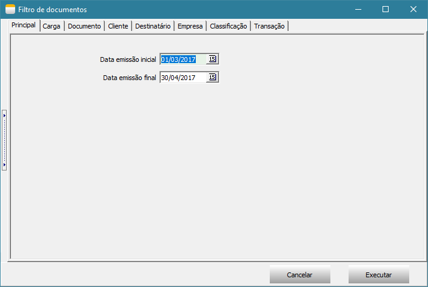

Após importação de todos os dados da nota fiscal, é exibido uma tela com detalhamento do que foi importado e também é gravado um arquivo texto no documento
com todas as informações importadas da MadeiraMadeira.

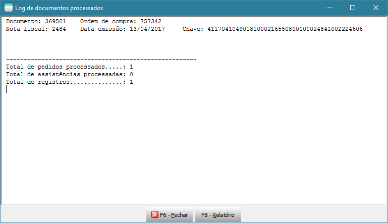

#### Emitindo nota fiscal(TEK-> MADEIRA MADEIRA: EMITIR NFE)
O processamento TEK-> MADEIRA MADEIRA: EMITIR NFE irá emitir as notas fiscais de remessa e simbólica somente dos documentos que o faturamento foi liberado 
através do processamento TEK-> MADEIRA MADEIRA: VERIFICAR SE FATURAMENTO LIBERADO. Ao executar será exibido uma tela com filtros de documentos e em seguida 
será executado o processo.

#### Enviando notas fiscais para MadeiraMadeira(TEK-> MADEIRA MADEIRA: COMPARTILHAR NFE)
O processamento TEK-> MADEIRA MADEIRA: COMPARTILHAR NFE irá enviar o XML das notas fiscais de remessa e simbólica para MadeiraMadeira. Somente será enviado  
otas fiscais faturadas. Ao executar será exibido uma tela com filtros de documentos e em seguida será executado o processo.

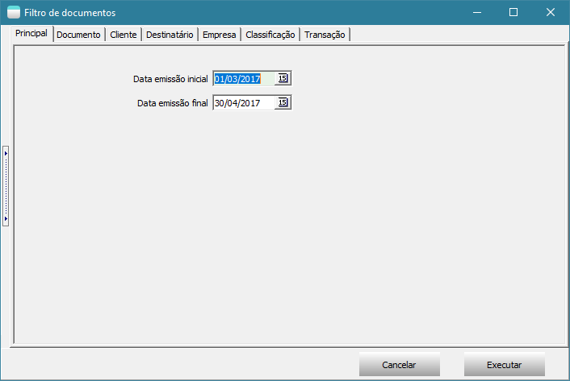

### Agendamento dos processos no Agendador de Tarefas do Windows

  > __Importante: Levante um TekServer somente para execução destes processamentos. Este TekServer deve ser 32 bits.__

Para realizar o agendamento dos processos no Agendador de Tarefas do Windows, acesse Painel de Controle -> Ferramentas Administrativas -> Agendador de Tarefas.

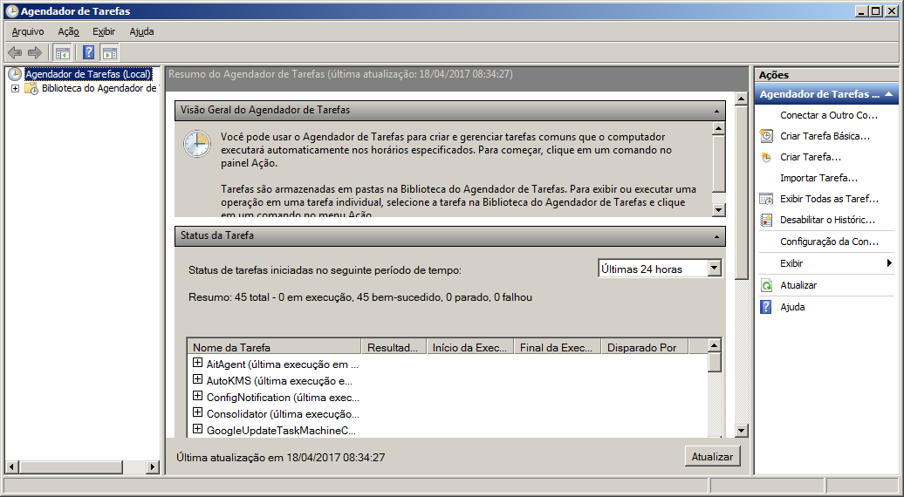

Selecione Biblioteca do Agendador de Tarefas e clique em Nova Pasta para criar uma pasta chamada Tek-System.

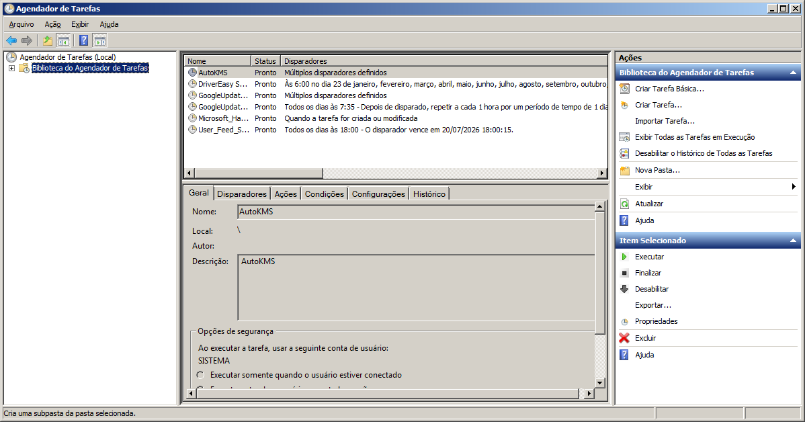

Em seguida selecione a pasta Tek-System e clique em Criar Tarefa...

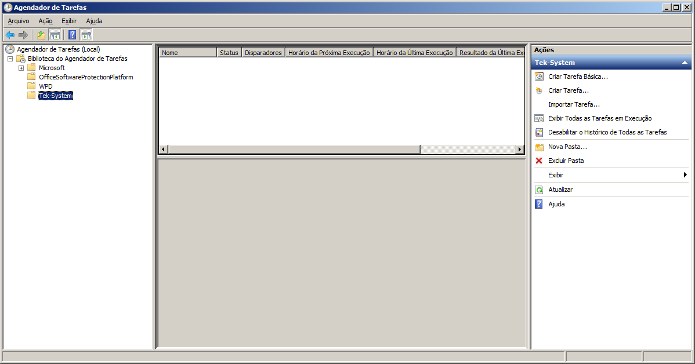

Na tela “Criar Tarefa” deve seguir um padrão para o nome conforme exemplo abaixo.

  > Exemplo: Madeira Madeira: Atualizar estoque.

Defina o intervalo de execução do agendamento na guia Disparadores junto com o responsável pelo servidor da empresa.

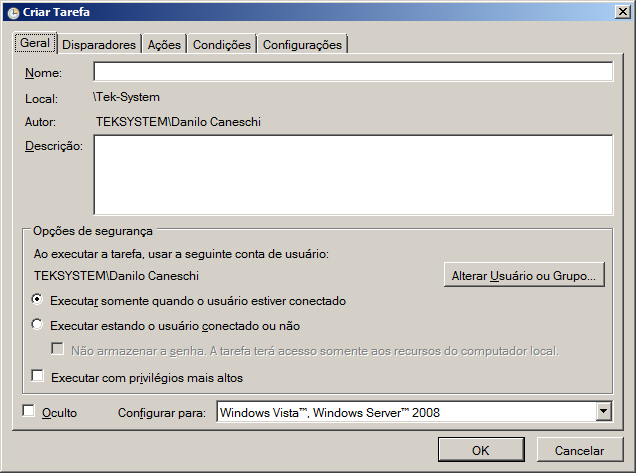

Na guia Ações clique em Novo para informar o script a ser executado neste agendamento. Ao clicar em Novo será aberto a tela abaixo.

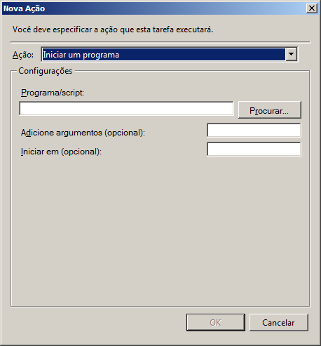

No campo Programa/Script adicione o script para agendamento conforme descrito abaixo.
A execução do processamento é realizada pelo módulo ExecMetodoInterpERP.exe, para executar as funções abaixo é necessário preencher alguns parâmetros, são:

* -U: Nome do usuário que irá executar o processamento. O ideal é criar um usuário específico para isso;
* -S: Senha do usuário;
* -P: Porta de conexão com o TekServer;
* -E: Código da empresa;
* -M: Nome do método a ser executado.

Confira se o módulo ExecMetodoInterpERP.exe está no diretório “C:\tek-system\execmc\”. Este módulo fica localizado no diretório dos executáveis do sistema.

> __Importante__: Antes de criar o agendamento para cada script abaixo, faça um teste de execução através do prompt de comando. Para testar a funcionamento do script,
 copie e cole-o no prompt de comando e tecle Enter para ver o resultado.

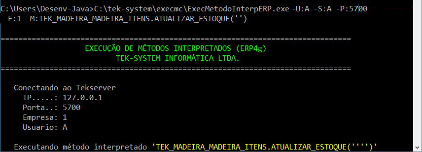

Abaixo contém todos os script para cada processamento.

* Automatizar a atualização de saldos:
  > C:\tek-system\execmc\ExecMetodoInterpERP.exe -U:NOME_USUARIO -S:SENHA -P:5700 -E:1 -M:TEK_MADEIRA_MADEIRA_ITENS.ATUALIZAR_ESTOQUE('')
* Automatizar a atualização de status de itens:
  > C:\tek-system\execmc\ExecMetodoInterpERP.exe -U:NOME_USUARIO -S:SENHA -P:5700 -E:1 -M:TEK_MADEIRA_MADEIRA_ITENS.ATUALIZAR_STATUS('')
* Automatizar a importação de pedidos do site:
  > C:\tek-system\execmc\ExecMetodoInterpERP.exe -U:NOME_USUARIO -S:SENHA -P:5700 -E:1 -M:TEK_MADEIRA_MADEIRA_DOCUMENTOS.IMPORTAR
* Automatizar aviso de venda à ordem pronta para faturamento:
  > C:\tek-system\execmc\ExecMetodoInterpERP.exe -U:NOME_USUARIO -S:SENHA -P:5700 -E:1 -M:TEK_MADEIRA_MADEIRA_VENDA_A_ORDEM.SOLICITAR_FATURAMENTO('')
* Automatizar monitoramento de faturamento liberado pela MadeiraMadeira:
  > C:\tek-system\execmc\ExecMetodoInterpERP.exe -U:NOME_USUARIO -S:SENHA -P:5700 -E:1 -M:TEK_MADEIRA_MADEIRA_VENDA_A_ORDEM.VERIFICAR_SE_FATURAMENTO_LIBERADO('')
* Automatizar faturamento de venda à ordem:
  > C:\tek-system\execmc\ExecMetodoInterpERP.exe -U:NOME_USUARIO -S:SENHA -P:5700 -E:1 -M:TEK_MADEIRA_MADEIRA_EMISSAO_NFE.FATURAR
* Compartilhar Notas Fiscais com WebService
  > C:\tek-system\execmc\ExecMetodoInterpERP.exe -U:NOME_USUARIO -S:SENHA -P:5700 -E:1 -M:TEK_MADEIRA_MADEIRA_COMPARTILHAR_NFE.COMPARTILHAR

#### Indicadores

É disponibilizado 3 indicadores padrões para auxiliar na integração com MadeiraMadeira, são:

* MADEIRA MADEIRA: QTDE DOC. SEM PEDIDO DE AUTORIZAÇÃO P/ FAT: Apresenta a quantidade de documentos importados que não estão em carga e/ou não foram 
  totalmente reservados;
* MADEIRA MADEIRA: QTDE DOC. AGUARDANDO AUTORIZAÇÃO P/ FAT: Apresenta a quantidade de documentos que já estão em carga totalmente reservados aguardando 
  autorização da MadeiraMadeira para faturar;
* MADEIRA MADEIRA: QTDE DOC. FATURAMENTO PENDENTE PELA EMPRESA: Apresenta a quantidade de documentos autorizados pela MadeiraMadeira, mas pendente de 
  faturamento pela empresa.

Todos esses indicadores possuem detalhamentos por documento e por item.

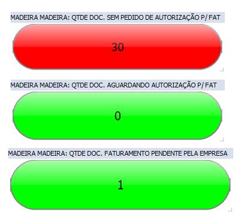

# Dúvidas ou Sugestões?

Caso você não esteja logado, faça seu login, acesse a area de [Issues](/../issues) e cadastre sua dúvida ou sugestão.