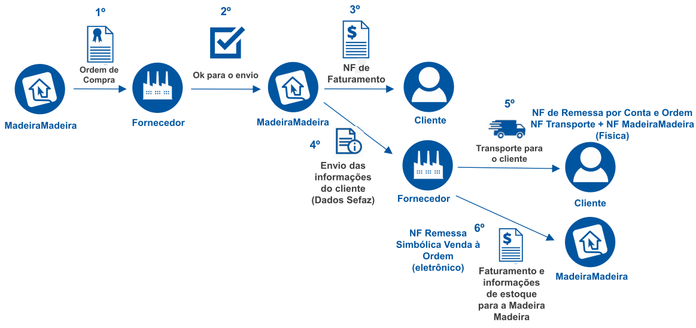
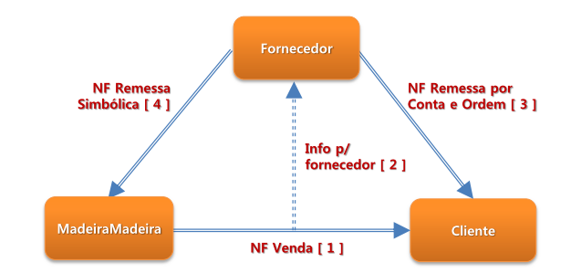

## A Integração

(Processo de integração com o E-commerce)

Veja a [Especificação Técnica](Especificação_Técnica_Projeto_VendaAOrdem.pdf) para mais detalhes.

#### O que é Venda à Ordem?
Venda à ordem é uma operação triangular, configura-se como aquela em que determinada mercadoria é adquirida sob a condição
de a sua entrega ser efetivada pelo próprio fornecedor em estabelecimento de terceiro, por conta e ordem do adquirente
originário.
A venda à ordem é uma modalidade de operação triangular, pois envolve 3 estabelecimentos em uma mesma operação. Assim,
nesse tipo de venda, serão utilizadas as seguintes denominações para se abordar o tratamento fiscal adotado:

  a) fornecedor - estabelecimento que vende a mercadoria;

  b) adquirente original - estabelecimento que adquire a mercadoria e já a revende, sem que essa transite por seu estabelecimento, ou seja,
     solicita que a mercadoria adquirida seja entregue diretamente a seu cliente;

  c) destinatário - estabelecimento que adquiriu a mercadoria do adquirente original.

